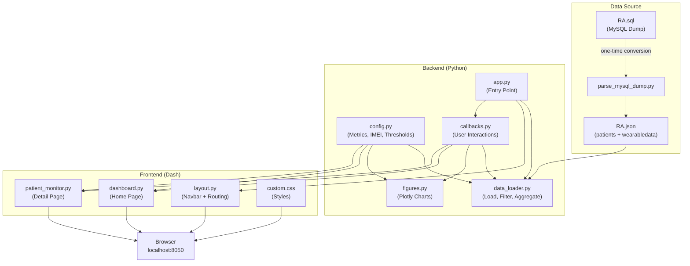
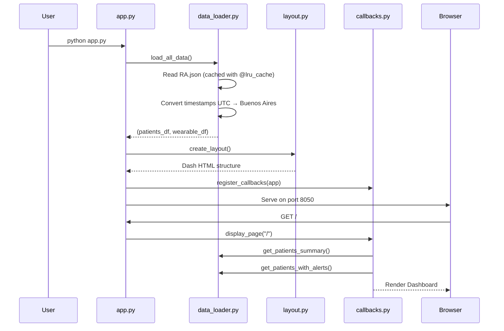
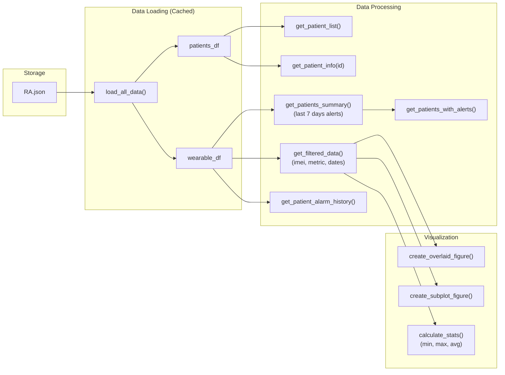
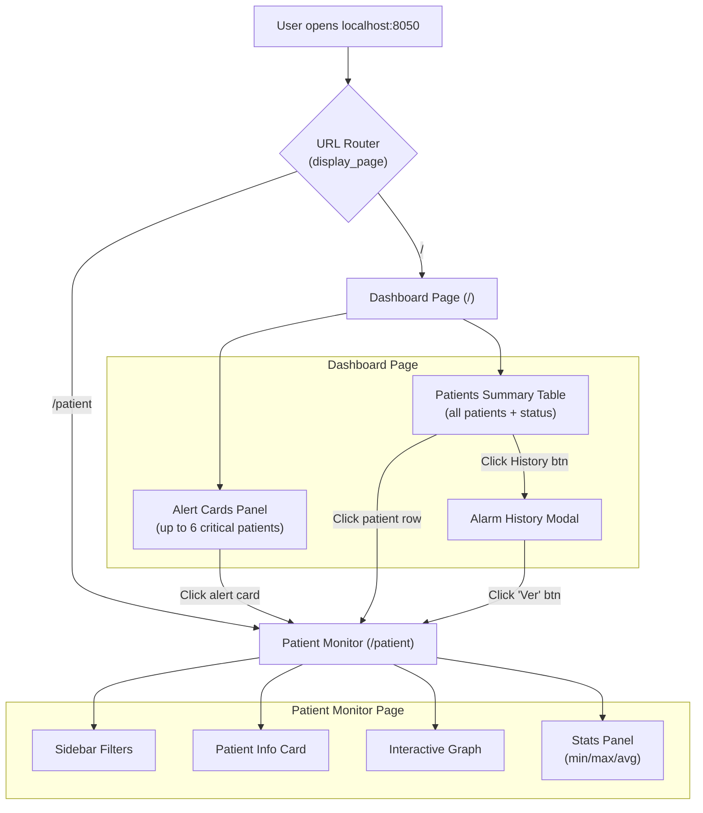
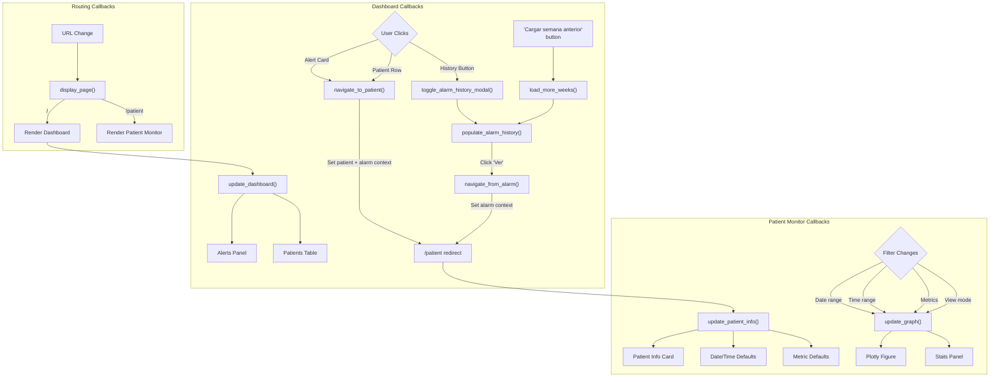
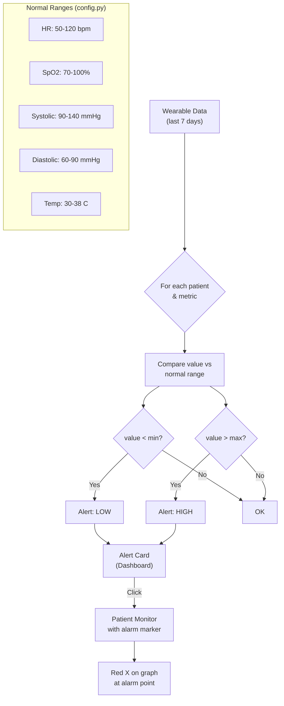
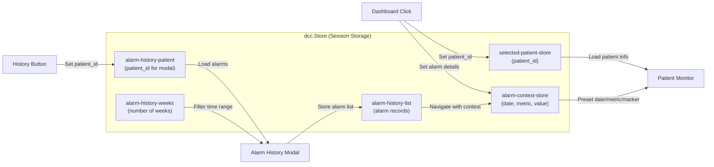
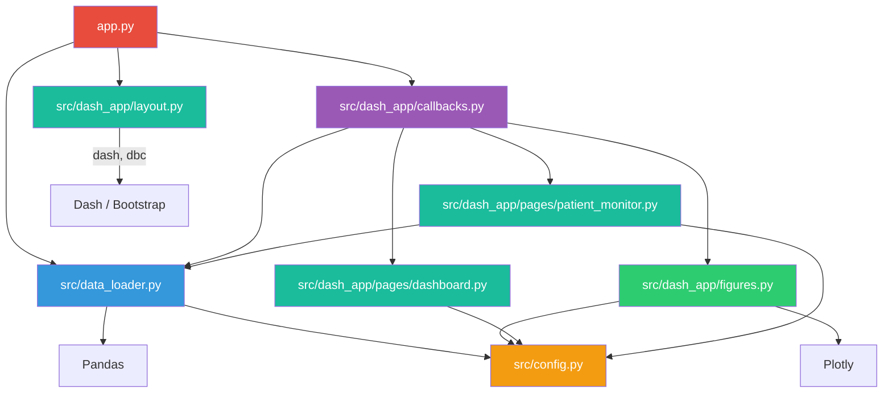

# VITAICARE - Application Flow Diagram

## 1. High-Level Architecture

## 2. Application Startup Sequence

## 3. Data Flow

## 4. Page Routing & Navigation

## 5. Callback Interaction Map

## 6. Alert Detection Flow

## 7. Session Data Flow

## 8. File Dependency Graph

## 9. Monitored Metrics Overview

| Metric | Name (Spanish) | Unit | Normal Range | Color |
|--------|---------------|------|-------------|-------|
| `heart_rate` | Frecuencia Cardiaca | bpm | 50 - 120 |  |
| `blood_oxygen_saturation` | Saturacion O2 | % | 70 - 100 |  |
| `systolic_blood_pressure` | Presion Sistolica | mmHg | 90 - 140 |  |
| `diastolic_blood_pressure` | Presion Diastolica | mmHg | 60 - 90 |  |
| `temperature` | Temperatura | C | 30 - 38 |  |
| `daily_activity_steps` | Pasos Diarios | steps | 0+ |  |
